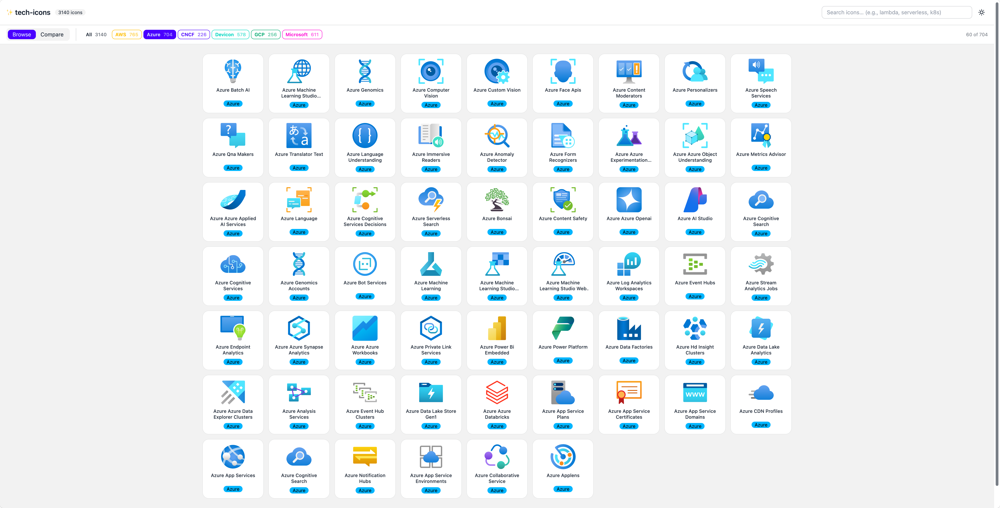
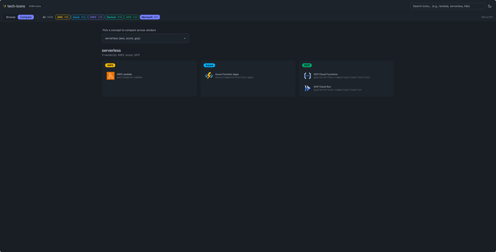

# tech-icons

MCP server exposing 3100+ cloud technology icons (AWS, Azure, GCP, Microsoft) as searchable tools. Features 3-tier search (exact → keyword → fuzzy → semantic), multiple output formats, and integrations with ppt-master and architecture diagram generators.





| Vendor | Icons | Source |
|--------|-------|--------|
| AWS | 765 | Architecture-Service, Category, Resource, Group Icons (48px) |
| Azure | 704 | Azure Public Service Icons |
| CNCF | 226 | CNCF landscape icon package |
| Devicon | 578 | Devicon technology icon set |
| GCP | 256 | Category Icons + Core Product Icons |
| Microsoft | 611 | Fabric, M365, Dynamics 365, Entra, Power Platform |
| **Total** | **3,140** | Deduplicated from 9,468 raw SVGs |

## Quick Start

### End users (PyPI / uvx)

The published wheel bundles the icon catalog and SVGs—no local build step.

```bash
uvx tech-icons

uvx --with 'tech-icons[semantic]' tech-icons

uvx --with 'tech-icons[web]' tech-icons --web
```

Run from this repository without a PyPI release:

```bash
uvx --from git+https://github.com/zhiweio/tech-icons tech-icons
```

### MCP Configuration

Add to your `.mcp.json` or MCP client config:

```json
{
  "mcpServers": {
    "tech-icons": {
      "command": "uvx",
      "args": ["tech-icons"],
      "env": {}
    }
  }
}
```


For semantic search, use "args": ["--with", "tech-icons[semantic]", "tech-icons"] with "command": "uvx" (or install `tech-icons[semantic]` in your environment).

## Web UI

```bash
uvx --with 'tech-icons[web]' tech-icons --web --port 8765 --open
```

Opens the local icon browser at http://127.0.0.1:8765 (loopback only).

## Available Tools

| Tool | Description |
|------|-------------|
| `search_icons` | Search icons by query with optional vendor/category filters |
| `get_icon` | Get full metadata for an icon by canonical ID |
| `get_icon_svg` | Get icon SVG content in a specified format |
| `list_categories` | List available categories (optionally per vendor) |
| `list_vendors` | List vendors with icon counts |

## Format Options

| Format | Output | Use Case |
|--------|--------|----------|
| `raw` | SVG XML string | Inspection, direct embedding |
| `path` | Absolute file path | Local tooling, file references |
| `base64` | Base64-encoded SVG | Binary transport, JSON payloads |
| `data_uri` | `data:image/svg+xml;base64,...` | HTML `` tags, CSS |
| `ppt_master` | `<use data-icon="..."/>` | ppt-master skill integration |
| `inline_group` | `<g viewBox="...">...</g>` | SVG composition, arch diagrams |

## Icon IDs

Canonical format: `{vendor}/{category}/{name}`

Examples: `aws/compute/lambda`, `azure/databases/cosmos-db`, `gcp/containers/gke`, `microsoft/365/teams`

## Integrations

**ppt-master:** Use `format="ppt_master"` or the bridge script to export icons into ppt-master template directories.

```bash
python3 -m tech_icons.bridges.ppt_master --icons aws/compute/lambda,gcp/compute/cloud-run --target ./templates/icons/tech/
```

**Architecture diagrams:** Use `format="data_uri"` for HTML img tags or `format="inline_group"` for direct SVG composition. See [docs/integration-arch-diagram.md](docs/integration-arch-diagram.md).

## Development

Requires [uv](https://docs.astral.sh/uv/) for dependency management.

```bash
# Install with dev dependencies
uv sync --group dev

# Format code
make format

# Lint
make lint

# Type check
make typecheck

# All checks (lint + typecheck)
make check

# Run tests
make test

# Format + lint + typecheck + test
make all
```

Other useful commands:

```bash
# Start MCP server
make serve

# Local icon browser
make web
```

### Tooling

- **Formatter/Linter:** [ruff](https://docs.astral.sh/ruff/) (line-length: 120)
- **Type checker:** [mypy](https://mypy-lang.org/) (disallow-untyped-defs)
- **Tests:** [pytest](https://pytest.org/) + pytest-asyncio
