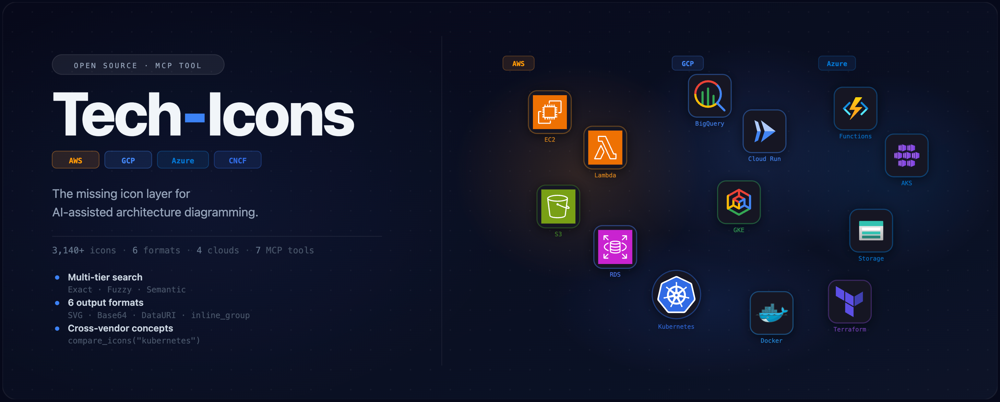
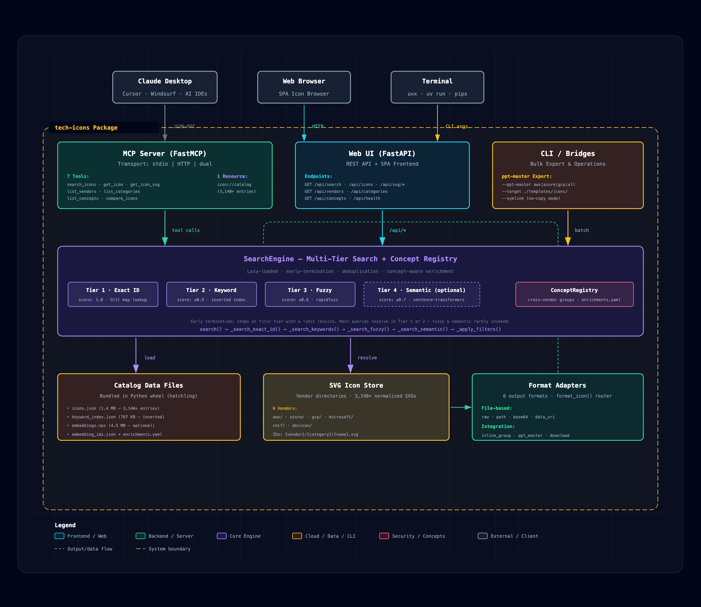

<!-- markdownlint-disable MD033 MD041 -->
<!-- mcp-name: tech-icons -->
# tech-icons

**English** | [中文](./README_zh.md)

<p align="center">
  
</p>

<p align="center">
  <strong>3,100+ Cloud Tech Icons · Searchable MCP Server · Architecture Diagrams</strong>
</p>

<p align="center">
  <a href="https://pypi.org/project/tech-icons/"></a>
  <a href="https://github.com/zhiweio/tech-icons/blob/master/LICENSE"></a>
  <a href="https://pypi.org/project/tech-icons/"></a>
  <a href="https://modelcontextprotocol.io"></a>
  <a href="https://fastmcp.org"></a>
</p>

<p align="center">
  
</p>

The missing icon layer for AI-assisted architecture diagramming. Give your LLMs the power to *see* and *place* cloud icons across AWS, Azure, GCP, and Microsoft—directly, without switching tabs or hunting through vendor docs.

## ✨ Features

- 🔍 **Multi-Tier Search** — Exact ID → Keyword → Fuzzy → Semantic embedding search, layered for precision and recall
- 🎨 **6 Output Formats** — Raw SVG, Base64, Data URI, Inline `<g>`, File path, ppt-master placeholder—pick what fits
- 🔗 **Cross-Vendor Concepts** — `compare_icons("kubernetes")` returns the K8s icon from AWS, Azure, *and* GCP in one call
- 🌐 **Streamable HTTP + stdio** — Run locally (`stdio`) or as a web service (`--transport http`), or both (`--transport dual`)
- 🖥️ **Built-in Web UI** — `--web` launches a local icon browser (FastAPI + SPA) for visual exploration
- 📦 **Zero Build, Works Everywhere** — Icons are bundled in the wheel; no local build step, works with `uvx` directly
- ⚡ **FastMCP Framework** — Modern decorator-based tool registration with automatic JSON Schema generation
- 🧩 **Extensible** — `format="ppt_master"` generates placeholders for [ppt-master](https://github.com/hugohe3/ppt-master); `format="inline_group"` composes directly into SVG architecture diagrams

## 📋 Table of Contents

- [tech-icons](#tech-icons)
  - [✨ Features](#-features)
  - [📋 Table of Contents](#-table-of-contents)
  - [🚀 Quick Start](#-quick-start)
    - [Run directly (no install needed)](#run-directly-no-install-needed)
    - [Run from this repository (development)](#run-from-this-repository-development)
  - [📦 Installation \& Requirements](#-installation--requirements)
    - [Extras at a glance](#extras-at-a-glance)
  - [🔧 Usage Modes](#-usage-modes)
    - [1. MCP Server (stdio)](#1-mcp-server-stdio)
    - [2. MCP Server (Streamable HTTP)](#2-mcp-server-streamable-http)
    - [3. Dual Transport (stdio + HTTP)](#3-dual-transport-stdio--http)
    - [4. Web UI](#4-web-ui)
    - [5. PPT-Master Export](#5-ppt-master-export)
  - [🖥️ MCP Client Configuration](#️-mcp-client-configuration)
    - [Claude Desktop / Claude Code](#claude-desktop--claude-code)
    - [With semantic search](#with-semantic-search)
    - [Streamable HTTP (remote / self-hosted)](#streamable-http-remote--self-hosted)
    - [Cursor / Windsurf / other MCP-compatible editors](#cursor--windsurf--other-mcp-compatible-editors)
  - [🐳 Docker](#-docker)
    - [Quick Start](#quick-start-1)
    - [docker-compose](#docker-compose)
    - [Environment Variables](#environment-variables)
    - [Claude Desktop Configuration (Docker)](#claude-desktop-configuration-docker)
  - [🛠️ Tools \& API Reference](#️-tools--api-reference)
    - [Tools](#tools)
    - [Resource](#resource)
    - [LLM Usage Examples](#llm-usage-examples)
  - [🎨 Format Options](#-format-options)
  - [🏷️ Icon ID Convention](#️-icon-id-convention)
  - [🏗️ Architecture \& Design](#️-architecture--design)
    - [Key Design Decisions](#key-design-decisions)
    - [Technology Stack](#technology-stack)
  - [🔗 Integrations](#-integrations)
    - [ppt-master](#ppt-master)
    - [Architecture Diagrams](#architecture-diagrams)
    - [Semantic Search](#semantic-search)
  - [🔬 Development](#-development)
    - [Project Structure](#project-structure)
    - [Running Tests](#running-tests)
    - [Tooling](#tooling)
  - [❓ FAQ](#-faq)
  - [🏅 Icon Sources & Attributions](#-icon-sources--attributions)
  - [📄 License](#-license)

## 🚀 Quick Start

### Run directly (no install needed)

```bash
# stdio MCP server — ready for Claude Desktop, Cursor, etc.
uvx tech-icons

# With semantic search (sentence-transformers embeddings)
uvx --with 'tech-icons[semantic]' tech-icons

# Launch the web icon browser
uvx --with 'tech-icons[web]' tech-icons --web --open

# Run as a Streamable HTTP service
uvx --with 'tech-icons[web]' tech-icons --transport http --port 8000
```

### Run from this repository (development)

```bash
git clone https://github.com/zhiweio/tech-icons.git
cd tech-icons
uv run tech-icons
```

That's it. The published wheel bundles the full icon catalog (~1.4 MB metadata + SVGs)—no local build step, no asset download.

## 📦 Installation & Requirements

| Requirement | Details |
|-------------|---------|
| **Python** | ≥ 3.10 |
| **Package Manager** | [uv](https://docs.astral.sh/uv/) (recommended), pip, pipx |
| **Core Dependencies** | `fastmcp`, `pyyaml`, `rapidfuzz` |
| **Web UI (optional)** | `fastapi`, `uvicorn` (`[web]` extra) |
| **Semantic Search (optional)** | `sentence-transformers`, `numpy` (`[semantic]` extra) |
| **Everything** | `[all]` extra = `[web,semantic]` |

```bash
# Install with all features
uvx --with 'tech-icons[all]' tech-icons

# Or install globally
uv tool install 'tech-icons[all]'
tech-icons --web
```

### Extras at a glance

| Extra | Adds | When to use |
|-------|------|-------------|
| *none* | Core MCP server (stdio) | Claude Desktop, Cursor, any MCP client |
| `[web]` | FastAPI + uvicorn | `--web` browser UI, `--transport http` |
| `[semantic]` | sentence-transformers | Tier-4 semantic search for vague queries |
| `[all]` | both of the above | Full functionality |

## 🔧 Usage Modes

`tech-icons` supports five distinct operating modes, selected by CLI flags:

```
tech-icons                                    # stdio MCP (default)
tech-icons --transport http --port 8000       # Streamable HTTP MCP
tech-icons --transport dual                   # stdio + HTTP simultaneously
tech-icons --web --open                       # Local browser UI
tech-icons --ppt-master aws --target ./icons/  # Bulk icon export
```

### 1. MCP Server (stdio)

The default mode. The server reads MCP JSON-RPC messages from stdin and writes responses to stdout. This is what MCP clients like Claude Desktop and Cursor expect.

```bash
uvx tech-icons
# or with semantic search:
uvx --with 'tech-icons[semantic]' tech-icons
```

**How it works**: The client process spawns `uvx tech-icons` as a child process, communicates via stdin/stdout. One process per client session. No ports, no network—pure local IPC.

### 2. MCP Server (Streamable HTTP)

Run as a persistent HTTP service. Multiple clients can connect simultaneously. Uses the [Streamable HTTP protocol](https://modelcontextprotocol.io/docs/concepts/transports#streamable-http) for full bidirectional communication including streaming responses.

```bash
uvx --with 'tech-icons[web]' tech-icons --transport http --host 0.0.0.0 --port 8000
```

**How it works**: Uvicorn ASGI server starts, serving the MCP endpoint at `http://host:port/mcp`. Clients connect over HTTP/2 with streaming support. The server stays running—start once, many clients connect.

### 3. Dual Transport (stdio + HTTP)

Run **both transports simultaneously** on a single process with a shared engine instance. Perfect for development workflows where you want local IDE integration *and* a network-accessible service.

```bash
uvx --with 'tech-icons[web]' tech-icons --transport dual --port 8000
```

**How it works**: `asyncio.gather()` runs `run_stdio_async()` and `run_http_async()` concurrently. Both share the same `SearchEngine` instance (loaded once). Use **Ctrl+C** to stop.

### 4. Web UI

Launch a local icon browser with full-text search, vendor/category filters, paginated catalog, and SVG preview/download.

```bash
uvx --with 'tech-icons[web]' tech-icons --web --port 8765 --open
```

Opens `http://127.0.0.1:8765` in your browser. The web UI uses the same `SearchEngine` class as the MCP server—no logic duplication.

### 5. PPT-Master Export

Batch-export SVG icons into a ppt-master template directory. Supports vendor names, comma-separated icon IDs, or `all`.

```bash
# Export a single vendor
uvx tech-icons --ppt-master aws --target ./templates/icons/

# Export specific icons
uvx tech-icons --ppt-master aws/compute/lambda,gcp/compute/cloud-run

# Export everything
uvx tech-icons --ppt-master all

# Use symlinks (no file copy overhead)
uvx tech-icons --ppt-master aws --symlink
```

## 🖥️ MCP Client Configuration

### Claude Desktop / Claude Code

```json
{
  "mcpServers": {
    "tech-icons": {
      "command": "uvx",
      "args": ["tech-icons"]
    }
  }
}
```

### With semantic search

```json
{
  "mcpServers": {
    "tech-icons": {
      "command": "uvx",
      "args": ["--with", "tech-icons[semantic]", "tech-icons"]
    }
  }
}
```

### Streamable HTTP (remote / self-hosted)

```json
{
  "mcpServers": {
    "tech-icons": {
      "url": "http://your-server:8000/mcp",
      "transport": "http"
    }
  }
}
```

### Cursor / Windsurf / other MCP-compatible editors

Use the same `stdio` configuration as Claude Desktop above. For HTTP transport, check your editor's MCP documentation for HTTP endpoint support.

## 🐳 Docker

Pre-built Docker image with both MCP server and Web UI modes. Choose via the `SERVER_MODE` environment variable.

### Quick Start

```bash
# Build the image
docker build -t tech-icons .

# Run as MCP Streamable HTTP server (default)
docker run -p 8765:8765 tech-icons

# Run as Web UI (icon browser)
docker run -p 8765:8765 -e SERVER_MODE=web tech-icons
```

### docker-compose

```bash
# MCP server mode
docker compose --profile mcp up -d

# Web UI mode
docker compose --profile web up -d
```

### Environment Variables

| Variable | Default | Description |
|----------|---------|-------------|
| `SERVER_MODE` | `http` | `http` = MCP Streamable HTTP server, `web` = FastAPI web UI |
| `HOST` | `0.0.0.0` | Bind address (always `0.0.0.0` inside the container) |
| `PORT` | `8765` | Listen port |
| `LOG_LEVEL` | `info` | Python log level |

### Claude Desktop Configuration (Docker)

Connect Claude Desktop to a containerized tech-icons via Streamable HTTP:

```json
{
  "mcpServers": {
    "tech-icons": {
      "type": "streamableHttp",
      "url": "http://localhost:8765/mcp"
    }
  }
}
```

> **Note**: The container binds `0.0.0.0:8765`. If running the container on a remote host, replace `localhost` with the host's IP address.

## 🛠️ Tools & API Reference

`tech-icons` exposes **7 tools**, **1 resource**, and **cross-vendor concept groups**:

### Tools

| Tool | Parameters | Returns | Description |
|------|-----------|---------|-------------|
| `search_icons` | `query` (required), `vendor`, `category`, `limit` | `list[dict]` | Multi-tier search: exact ID → keyword → fuzzy → semantic |
| `get_icon` | `id` (e.g., `aws/compute/lambda`) | `dict` | Full metadata: vendor, category, name, aliases, tags, description, path |
| `get_icon_svg` | `id`, `format` (default: `raw`) | `str` or `list` | SVG content in chosen format; `download` returns `Image` attachment |
| `list_categories` | `vendor` (optional) | `list[str]` | All icon categories, optionally filtered by vendor |
| `list_vendors` | *none* | `dict[str, int]` | Vendor name → icon count mapping |
| `list_concepts` | *none* | `list[str]` | Cross-vendor concept names (e.g., `kubernetes`, `serverless`) |
| `compare_icons` | `concept` (e.g., `kubernetes`) | `dict` | Icons from all vendors for a concept, grouped by vendor |

All parameters with `Annotated[type, "description"]` type hints auto-generate JSON Schema via FastMCP.

### Resource

| URI | MIME Type | Content |
|-----|-----------|---------|
| `icon://catalog` | `application/json` | Full 3,140+ entry icon catalog with all metadata |

### LLM Usage Examples

**Find an icon for a specific AWS service:**
```
search_icons(query="Lambda")
```

**Compare Kubernetes icons across clouds:**
```
compare_icons(concept="kubernetes")
```

**Get a data URI for embedding in an HTML architecture diagram:**
```
get_icon_svg(id="gcp/compute/cloud-run", format="data_uri")
```

**List all Azure database services:**
```
search_icons(query="database", vendor="azure", category="databases")
```

**Explore the full catalog:**
```
read_resource("icon://catalog")
```

## 🎨 Format Options

Each format serves a distinct integration scenario:

| Format | Output | Use Case | Example |
|--------|--------|----------|---------|
| `raw` | SVG XML string | Inspection, direct embedding | `"<svg xmlns=\"...\">...</svg>"` |
| `path` | Absolute filesystem path | Local tooling, file references | `"/path/to/icons/aws/compute/lambda.svg"` |
| `base64` | Base64-encoded SVG | Binary transport, JSON payloads | `"PHN2ZyB4bWxucz0i..."` |
| `data_uri` | `data:image/svg+xml;base64,...` | HTML `` tags, CSS backgrounds | `"data:image/svg+xml;base64,..."` |
| `inline_group` | `<g viewBox="...">...</g>` | Direct SVG composition in diagrams | `"<g viewBox=\"0 0 64 64\"><path d=\"...\"/></g>"` |
| `ppt_master` | `<use data-icon="tech-icons/..."/>` | ppt-master skill placeholder | `"<use data-icon=\"tech-icons/aws/compute/lambda\"/>"` |
| `download` | Text summary + `Image` attachment | Download the SVG file | Text + `Image(data=..., format="svg+xml")` |

## 🏷️ Icon ID Convention

All icons follow a consistent canonical ID format:

```
{vendor}/{category}/{name}
```

**Examples:**
- `aws/compute/lambda` — AWS Lambda
- `azure/databases/cosmos-db` — Azure Cosmos DB
- `gcp/serverless-computing/cloud-run` — Cloud Run
- `microsoft/365/teams` — Microsoft Teams
- `cncf/orchestration/kubernetes` — Kubernetes
- `devicon/framework/react` — React

IDs are **lowercase**, with **hyphens** for multi-word names. Use `list_categories(vendor="aws")` to explore available categories for a vendor.

## 🏗️ Architecture & Design

<p align="center">
  
</p>

### Key Design Decisions

1. **Single SearchEngine, multiple interfaces** — The `SearchEngine` class has *one* instance. The MCP server, FastAPI web app, and ppt-master CLI all wrap it—no logic duplication.

2. **Tiered search with early termination** — Search stops at the first tier that returns ≥ `limit` results. Most queries hit Tier 1 (exact ID) or Tier 2 (keyword index) and never reach fuzzy or semantic—fast and cheap.

3. **Bundled catalog in wheel** — `icons.json`, `keyword_index.json`, and SVGs are packaged via `hatchling`. `importlib.resources.files()` resolves paths at runtime, works in both dev (`uv run`) and installed (`uvx`, `pipx`) environments.

4. **Lazy loading** — The engine loads catalog data from disk only on first access (`_ensure_loaded()`). In stdio mode, `engine.load()` is called explicitly before `mcp.run()`.

5. **FastMCP decorator pattern** — Each tool is a standalone function decorated with `@mcp.tool`. Python type hints (`Annotated[str, "desc"]`, `Literal["aws", ...]`) auto-generate JSON Schema. No manual `inputSchema` writing.

6. **Cross-vendor concept registry** — `enrichments.yaml` defines technology concepts (e.g., "kubernetes") and maps them to icon IDs across vendors. Concept metadata is loaded on engine initialization and available as `engine.concepts`.

### Technology Stack

| Component | Technology | Rationale |
|-----------|-----------|-----------|
| MCP Framework | FastMCP 3.4 | Decorator-based, auto Schema, stdio+HTTP dual transport |
| Search Engine | Custom (4-tier) | Exact → keyword → fuzzy → semantic, early termination |
| Fuzzy Matching | rapidfuzz | Token-sort ratio scoring, C-accelerated |
| Semantic Search | sentence-transformers | all-MiniLM-L6-v2, optional extra |
| Web UI | FastAPI + SPA | Shared engine instance, CORS-enabled |
| Build System | hatchling | PEP 517, supports bundling data files |
| Package Manager | uv | Fast resolver, `uvx` for one-shot runs |

## 🔗 Integrations

### ppt-master

The `ppt_master` format generates `<use data-icon="tech-icons/..."/>` elements compatible with ppt-master's `embed_icons.py` hook. Use `--ppt-master` to bulk-export icons:

```bash
uvx tech-icons --ppt-master aws --target ./templates/icons/
uvx tech-icons --ppt-master aws/compute/lambda,gcp/compute/cloud-run --symlink
```

### Architecture Diagrams

Use `format="data_uri"` for HTML `` tags, or `format="inline_group"` for direct SVG `<g>` element composition:

```html
<!-- data_uri: embed in HTML -->


<!-- inline_group: embed in SVG canvas -->
<svg viewBox="0 0 800 400">
  <g transform="translate(50, 50)">
    INLINE_GROUP_OUTPUT
  </g>
</svg>
```

See [docs/integration-arch-diagram.md](docs/integration-arch-diagram.md) for complete examples with CSS styling, multi-cloud layouts, and vendor color conventions.

### Semantic Search

Add `[semantic]` extra to enable the 4th search tier. Useful for vague queries ("that thing for serverless") where keyword matching falls short:

```bash
uvx --with 'tech-icons[semantic]' tech-icons
```

## 🔬 Development

```bash
# Clone and set up
git clone https://github.com/zhiweio/tech-icons.git
cd tech-icons
uv sync --group dev

# Run tests
uv run pytest tests/ -v

# Lint + type check
uv run ruff check tech_icons/ tests/
uv run mypy tech_icons/

# Format
uv run ruff format tech_icons/ tests/

# All checks (format + lint + typecheck + test)
make all
```

### Project Structure

```
tech-icons-abilities/
├── tech_icons/                # Main package
│   ├── server.py              # FastMCP server + CLI (main entry point)
│   ├── search.py              # 4-tier search engine
│   ├── formats.py             # 6 SVG output format adapters
│   ├── concepts.py            # Cross-vendor concept registry
│   ├── normalize.py           # SVG normalization & catalog generation
│   ├── _paths.py              # Runtime path resolution (importlib.resources)
│   ├── web/
│   │   ├── app.py             # FastAPI HTTP API
│   │   └── static/            # SPA frontend (index.html + assets)
│   ├── bridges/
│   │   └── ppt_master.py      # ppt-master icon export bridge
│   ├── catalog/               # Pre-built data files (bundled in wheel)
│   │   ├── icons.json         # 3,140+ entries with full metadata
│   │   ├── keyword_index.json # Inverted keyword index
│   │   ├── embeddings.npz     # Sentence embeddings (optional)
│   │   ├── embedding_ids.json # Embedding-to-ID mapping
│   │   └── enrichments.yaml   # Cross-vendor concept definitions
│   └── icons/                 # Bundled SVG files (~3,140 files)
├── tests/                     # pytest test suite (258+ tests)
├── scripts/
│   ├── build_catalog.py       # Catalog build pipeline
│   └── normalize_icons.py     # SVG normalization script
├── docs/                      # Documentation, screenshots
├── pyproject.toml             # Build config, dependencies, tooling
├── Makefile                   # Development task runner
└── README.md                  # This file
```

### Running Tests

```bash
uv run pytest tests/ -v          # All tests
uv run pytest tests/test_server.py -v  # Server-specific
uv run pytest tests/ -v --cov   # With coverage
```

### Tooling

- **Formatter:** [ruff](https://docs.astral.sh/ruff/) (line-length: 120)
- **Linter:** ruff (E, W, F, I, N, UP, B, A, S, T20, RUF)
- **Type checker:** [mypy](https://mypy-lang.org/) (disallow-untyped-defs)
- **Test runner:** [pytest](https://pytest.org/) + pytest-asyncio (asyncio_mode=auto)

## ❓ FAQ

**Q: Do I need to build the catalog locally?**
A: No. `icons.json` and SVGs are bundled in the wheel. `uvx tech-icons` works immediately.

**Q: How is this different from the AWS/Azure/GCP icon libraries?**
A: tech-icons *aggregates* icons from 6 vendors into a single, searchable MCP server with consistent IDs and a cross-vendor concept system. Instead of hunting through multiple icon sets, you ask the LLM and it retrieves the right icon.

**Q: Can I use this without an MCP client?**
A: Yes. Use `--web` for a browser UI, `--transport http` for a REST-ish API, or import `SearchEngine` directly in Python (`from tech_icons import SearchEngine`).

**Q: Does semantic search require GPU?**
A: No. The default `all-MiniLM-L6-v2` model runs on CPU. Embeddings are precomputed—only the query vector is generated at runtime.

**Q: Can I add my own icons or vendors?**
A: Yes. Put SVG files under `assets/your-vendor-*`, update `tech_icons/normalize.py` with a collector function, then run `scripts/build_catalog.py`. See [Development](#-development) above.

**Q: What MCP protocol version does this support?**
A: FastMCP 3.4 supports MCP protocol version `2025-03-26`. All transports (stdio, Streamable HTTP) use this protocol.

## 🏅 Icon Sources & Attributions

tech-icons **aggregates** icons from the following sources. The project itself (server, search engine, tooling) is MIT-licensed, but the bundled icon files retain their original licenses and terms. Please review each source's license before redistributing or modifying the icons.

| Source | Vendor(s) | License / Terms | Notes |
|--------|-----------|-----------------|-------|
| [AWS Architecture Icons](https://aws.amazon.com/architecture/icons/) | `aws` | AWS [Terms of Service](https://aws.amazon.com/architecture/icons/) | Free to use for architecture diagrams. |
| [Azure Architecture Icons](https://learn.microsoft.com/en-us/azure/architecture/icons/) | `azure` | [Microsoft Terms](https://learn.microsoft.com/en-us/azure/architecture/icons/) | Free to use for architecture diagrams. |
| [Google Cloud Icons](https://cloud.google.com/icons) | `gcp` | Google Cloud [Brand Guidelines](https://cloud.google.com/icons) | Free to use for architecture diagrams. |
| [Microsoft 365 Architecture Icons](https://learn.microsoft.com/en-us/previous-versions/microsoft-365/solutions/architecture-icons-templates) | `microsoft` (365) | [Microsoft Terms](https://learn.microsoft.com/en-us/previous-versions/microsoft-365/solutions/architecture-icons-templates) | |
| [Dynamics 365 Icons](https://learn.microsoft.com/en-us/dynamics365/get-started/icons) | `microsoft` (dynamics-365) | [Microsoft Terms](https://learn.microsoft.com/en-us/dynamics365/get-started/icons) | |
| [Microsoft Entra Architecture Icons](https://learn.microsoft.com/en-us/entra/architecture/architecture-icons) | `microsoft` (entra) | [Microsoft Terms](https://learn.microsoft.com/en-us/entra/architecture/architecture-icons) | |
| [Microsoft Fabric Icons](https://learn.microsoft.com/en-us/fabric/fundamentals/icons) | `microsoft` (fabric) | [Microsoft Terms](https://learn.microsoft.com/en-us/fabric/fundamentals/icons) | |
| [Power Platform Icons](https://learn.microsoft.com/en-us/power-platform/guidance/icons) | `microsoft` (power-platform) | [Microsoft Terms](https://learn.microsoft.com/en-us/power-platform/guidance/icons) | |
| [CNCF Artwork](https://github.com/cncf/artwork) | `cncf` | CNCF [Trademark & Logo Guidelines](https://github.com/cncf/artwork) | Trademarks owned by CNCF and respective projects. |
| [Devicon](https://github.com/devicons/devicon) | `devicon` | [MIT License](https://github.com/devicons/devicon/blob/master/LICENSE) | Icon fonts and SVGs for software technologies. |
| [Developer Icons](https://github.com/xandemon/developer-icons) | `developer` | [MIT License](https://github.com/xandemon/developer-icons) | Flat, colored technology icons. |

> **Note**: This project does **not** claim ownership of any bundled icon files. The icons are provided as-is from their respective upstream sources for convenience in AI-assisted diagramming workflows. The MIT license of this project applies to the server code, search engine, tooling, and documentation — **not** to the third-party icon assets.

## 📄 License

**Project code** (server, search engine, tooling, docs): MIT © [zhiweio](https://github.com/zhiweio)

**Bundled icons**: Each icon set retains its original license and terms as listed in [Icon Sources & Attributions](#-icon-sources--attributions).
